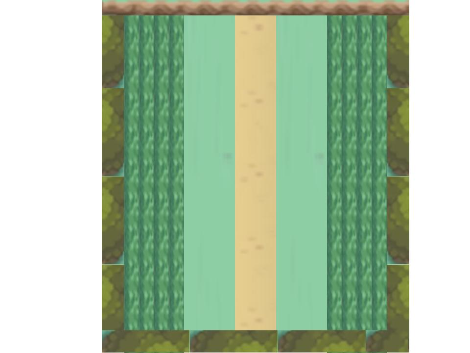

:warning: Everything between << >> needs to be replaced (remove << >> after replacing)

# << Project Title >>
## CS110 Final Project  << Semester, Year >>

## Team Members

Daniel Globus

***

## Project Description

This will be similar to a simple pokemon game, where a player walks around a fixed area which includes a path and some grass and some fence around the section (where the player can go). If the player walks into the grass for more than a set amount of time, they will engage in a pokemon battle where their pokemon uses moves against another pokemon. I will include the battle menu and everything like that. I plan on making the map fixed while the player can move for this game but may change that later.

***    

## GUI Design

### Initial Design

### Final Design

## Program Design

### Features

1. Start menu
2. Walking area
3. Pokemon battle menu
4. Grass detection
5. Easter Eggs

### Classes

- << You should have a list of each of your classes with a description >>

## ATP

| Step                 |Procedure             |Expected Results                   |
|----------------------|:--------------------:|----------------------------------:|
|  1                   | Run Counter Program  |GUI window appears with count = 0  |
|  2                   | click count button   | display changes to count = 1      |
etc...
